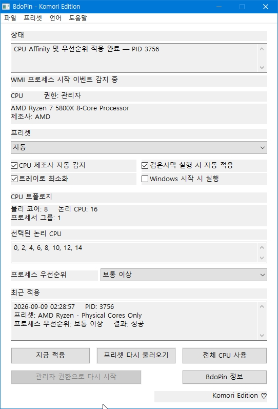
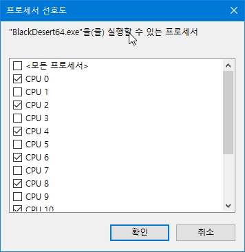

# BdoPin - Komori Edition

**English | [한국어](#한국어)**

A lightweight Windows utility for managing CPU affinity and process priority for Black Desert.

BdoPin lets you control which logical processors `BlackDesert64.exe` can use without changing the CPU configuration of the entire system.

---

## Screenshots

### Main Window

BdoPin detects the CPU topology and shows the selected logical CPUs, active preset, process priority, and the result of the most recent application.

### Applied Processor Affinity

The applied CPU affinity can also be verified through the Windows processor affinity dialog.

---

## Features

- AMD Ryzen SMT-aware CPU affinity presets
- Intel P-core / E-core aware presets
- Automatic CPU vendor and topology detection
- Process priority control
- Manual Apply / Use All CPUs
- Automatic detection of `BlackDesert64.exe`
- Korean and English UI
- Lightweight native Win32 application
- No external runtime required

---

## What does BdoPin do?

BdoPin uses standard Windows process-management APIs to configure the **CPU affinity** and **process priority** of `BlackDesert64.exe`.

For example, on an AMD Ryzen processor, the **Physical Cores Only** preset can select one logical processor from each physical CPU core.

BdoPin does **not** disable SMT or Hyper-Threading globally.

Only the Black Desert process is affected.  
Windows and other applications continue to use the CPU normally.

---

## Why use it?

Depending on the CPU architecture, game workload, and Windows scheduler behavior, some systems may perform more consistently when Black Desert is restricted to selected physical cores instead of using every available logical processor.

Possible improvements may include:

- reduced CPU scheduling interference
- more consistent frame times
- reduced stutter in some environments

Results vary depending on the system.

BdoPin does **not** guarantee higher FPS or improved performance.  
Try different presets and compare the results on your own system.

---

## Basic Usage

1. Start BdoPin.
2. Check the detected CPU information.
3. Select a preset.
4. Review the selected logical CPUs.
5. Choose the desired process priority.
6. Start Black Desert.
7. Press **Apply Now**.

To remove the affinity restriction and allow Black Desert to use all available CPUs again, use **Use All CPUs**.

---

## Administrator Privileges

BdoPin normally starts without administrator privileges.

When you press **Apply Now**, Windows may request administrator privileges if they are required to modify `BlackDesert64.exe`.

Automatic background detection does not display a UAC prompt by itself.

---

## Safety

BdoPin does not:

- read or modify game memory
- inject DLLs
- hook the game process
- modify Black Desert game files
- install a kernel driver
- patch the game
- attempt to bypass anti-cheat systems

BdoPin only uses Windows process-management APIs to configure CPU affinity and process priority.

---

## Download

Download the latest version from the **Releases** section of this repository.

Extract the downloaded ZIP file and run:

`BdoPin.exe`

---

## Komori Edition

Developed by **Eltax**.

I'm a Komori too, so I simply called it the **Komori Edition**.

---

# 한국어

**[English](#bdopin---komori-edition) | 한국어**

BdoPin은 검은사막의 CPU Affinity(프로세서 선호도)와 프로세스 우선순위를 간편하게 설정하기 위한 가벼운 Windows 유틸리티입니다.

시스템 전체의 CPU 설정을 변경하는 것이 아니라, `BlackDesert64.exe`가 사용할 논리 프로세서를 선택하여 제한하는 방식으로 동작합니다.

---

## 스크린샷

### 메인 화면

CPU 토폴로지, 선택된 논리 CPU, 현재 프리셋, 프로세스 우선순위와 최근 적용 결과를 확인할 수 있습니다.

### 적용된 프로세서 선호도

`BlackDesert64.exe`에 적용된 CPU Affinity는 Windows의 프로세서 선호도 화면에서도 확인할 수 있습니다.

---

## 주요 기능

- AMD Ryzen SMT 구조를 고려한 CPU Affinity 프리셋
- Intel P-Core / E-Core 구조를 고려한 프리셋
- CPU 제조사 및 토폴로지 자동 감지
- 프로세스 우선순위 설정
- 수동 적용 / 전체 CPU 사용 복원
- `BlackDesert64.exe` 자동 감지
- 한국어 / 영어 UI
- 가벼운 네이티브 Win32 프로그램
- 별도의 외부 런타임 불필요

---

## BdoPin은 무엇을 하나요?

BdoPin은 Windows의 표준 프로세스 관리 API를 사용하여 `BlackDesert64.exe`의 **CPU Affinity**와 **프로세스 우선순위**를 설정합니다.

예를 들어 AMD Ryzen 시스템에서 **Physical Cores Only** 프리셋을 선택하면 각 물리 코어에서 하나의 논리 프로세서만 선택하여 검은사막이 사용하도록 설정할 수 있습니다.

BdoPin은 시스템 전체의 SMT 또는 Hyper-Threading을 끄는 프로그램이 아닙니다.

설정은 검은사막 프로세스에만 적용되며, Windows와 다른 프로그램은 기존과 같이 CPU를 사용할 수 있습니다.

---

## 왜 사용하나요?

CPU 구조, 게임의 작업 부하, Windows 스케줄러의 동작 방식에 따라 일부 시스템에서는 모든 논리 프로세서를 사용하는 것보다 특정 물리 코어 위주로 검은사막을 실행했을 때 더 안정적인 결과를 보일 수 있습니다.

환경에 따라 다음과 같은 변화가 있을 수 있습니다.

- CPU 스케줄링 간섭 감소
- 프레임 타임 안정화
- 일부 환경에서 순간적인 끊김 감소

결과는 시스템마다 다를 수 있습니다.

BdoPin은 **FPS 상승이나 성능 향상을 보장하지 않습니다.**  
여러 프리셋을 직접 적용해 보고 자신의 시스템에서 결과를 비교해 사용하는 것을 권장합니다.

---

## 기본 사용법

1. BdoPin을 실행합니다.
2. 감지된 CPU 정보를 확인합니다.
3. 원하는 프리셋을 선택합니다.
4. 선택된 논리 CPU 목록을 확인합니다.
5. 원하는 프로세스 우선순위를 선택합니다.
6. 검은사막을 실행합니다.
7. **지금 적용** 버튼을 누릅니다.

Affinity 제한을 해제하고 검은사막이 다시 전체 CPU를 사용할 수 있게 하려면 **전체 CPU 사용** 기능을 사용하면 됩니다.

---

## 관리자 권한

BdoPin 자체는 일반 사용자 권한으로 실행할 수 있습니다.

사용자가 **지금 적용** 버튼을 눌렀을 때 `BlackDesert64.exe`를 변경하기 위해 관리자 권한이 필요한 환경에서는 Windows UAC가 표시될 수 있습니다.

백그라운드 자동 감지 기능만으로 UAC 창이 자동으로 나타나지는 않습니다.

---

## 안전성

BdoPin은 다음과 같은 동작을 하지 않습니다.

- 게임 메모리 읽기 또는 수정
- DLL 인젝션
- 게임 프로세스 후킹
- 검은사막 게임 파일 수정
- 커널 드라이버 설치
- 게임 코드 패치
- 안티치트 우회 시도

BdoPin은 Windows의 프로세스 관리 API를 이용하여 CPU Affinity와 프로세스 우선순위를 설정하는 기능만 수행합니다.

---

## 다운로드

이 저장소의 **Releases** 메뉴에서 최신 버전을 받을 수 있습니다.

다운로드한 ZIP 파일의 압축을 풀고:

`BdoPin.exe`

를 실행하면 됩니다.

---

## Komori Edition

개발: **Eltax**

저도 코모리라서 그냥 **Komori Edition**이라고 이름 붙였습니다.
